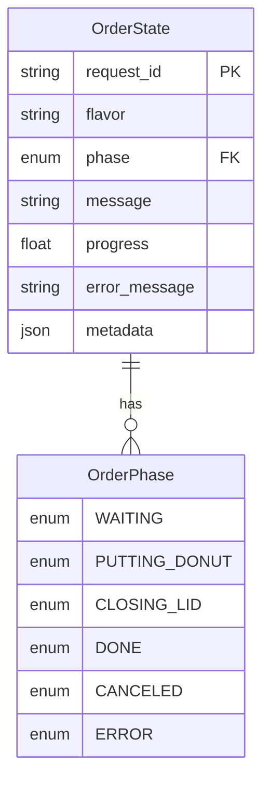

# GreatAkihabara Donuts - オーダーアプリ

FastAPI gateway + SmolVLA (per-order subprocess) + evdev-based `R` key gating.
Frontend (React + TypeScript) uses HTTP.

## アプリ構成

### システム構成図

```
┌─────────────────────────┐
│  フロントエンド          │
│  (React + TypeScript)   │
│  doughnuts_order_chatbot │
└──────────┬──────────────┘
           │ HTTP
           │
┌──────────▼──────────────┐
│   API Server            │
│   (FastAPI)             │
│   api.app:app           │
└──────────┬──────────────┘
           │ Unix Socket
           │
┌──────────▼──────────────┐
│  Robot Controller       │
│  (Worker Process)       │
│  robot_controller/worker│
└─────────────────────────┘
```

### ER図



## 起動方法

アプリケーションを起動するには、以下の3つのコンポーネントをそれぞれ起動する必要があります。

### 1. ロボットコントローラー（Worker）の起動

**注意**: ロボットコントローラーは、so101が繋がっているPCで動かす必要があります。

**Option A: Using the `worker` command (after `uv sync` on Linux)**:
```bash
cd mission2/code/doughnuts_order_assistant
uv sync  # Run this once on Linux to register the script
uv run worker  # Uses default arguments
# Or override specific arguments:
uv run worker --duration=60 --device=cpu
```

**Option B: Using the module directly (works everywhere, recommended)**:
```bash
cd mission2/code/doughnuts_order_assistant
uv run python -m robot_controller.worker_cli  # Uses default arguments
# Or override specific arguments:
uv run python -m robot_controller.worker_cli --duration=60 --device=cpu
```

**Option C: Using worker_main with full arguments**:
```bash
cd mission2/code/doughnuts_order_assistant
uv run python -m robot_controller.worker_main \
  --policy.path=masato-ka/smolvla-donuts-shop-v1 \
  --policy.device=cuda \
  --robot.type=bi_so101_follower \
  --robot.id=bi_robot \
  --robot.left_arm_port=/dev/ttyACM3 \
  --robot.right_arm_port=/dev/ttyACM2 \
  --robot.cameras="{front: {type: opencv, index_or_path: /dev/video4, width: 640, height: 480, fps: 30}, back: {type: opencv, index_or_path: /dev/video6, width: 640, height: 480, fps: 30}}" \
  --rtc.enabled=true \
  --rtc.execution_horizon=12 \
  --rtc.max_guidance_weight=10.0 \
  --duration=120 \
  --fps=30 \
  --device=cuda \
  --use_torch_compile=false \
  --policy.input_features='{"observation.state": {"type": "STATE", "shape": [12]}}' \
  --policy.output_features='{"action": {"type": "ACTION", "shape": [12]}}'
```

Workerプロセスは、APIサーバーとUnix Socket経由で通信し、注文を処理します。

### 2. APIサーバーの起動

**注意**: APIサーバーは、so101が繋がっているPCで動かす必要があります。

```bash
cd mission2/code/doughnuts_order_assistant
uv run uvicorn api.app:app --reload --host 0.0.0.0 --port 8000
```

APIサーバーは `http://0.0.0.0:8000` で起動します。

### 3. フロントエンドの起動

**注意**: フロントエンドは任意のPCで動かすことができます。

```bash
cd mission2/code/doughnuts_order_chatbot
npm install  # 初回のみ
npm run dev
```

フロントエンドは `http://localhost:3000` で起動します。

### API URLの設定について

フロントエンドのコードには、ngrokが発行したURLが直接埋め込まれています（`doughnuts_order_chatbot/src/App.tsx`内）。

- ngrokのURLが変更された場合
- localhostを使用したい場合

上記の場合は、`doughnuts_order_chatbot/src/App.tsx`内のAPIエンドポイントURLを修正する必要があります。

現在の設定箇所：
- `src/App.tsx` 68行目: 注文作成API (`/orders`)
- `src/App.tsx` 151行目: ステータス取得API (`/orders/{request_id}/status`)

## バックエンド詳細

### Doughnuts Order Assistant (current behavior)

### API
- **POST `/orders`**
  - Body: `{"flavor": "chocolate" | "strawberry"}`
  - Returns: `{"request_id": "..."}`
- **POST `/orders/{request_id}/cancel`**
  - Returns: `{"canceled": true}`
- **GET `/events`** (SSE)
  - `Content-Type: text/event-stream`
  - `data:` payload examples:
    - Status:
      ```json
      {"type":"status_update","request_id":"...","stage":"PUTTING_DONUT","progress":0.5,"message":"Putting doughnuts into the box..."}
      ```
    - Completed:
      ```json
      {"type":"completed","request_id":"...","result":{"delivered":true,"flavor":"chocolate"}}
      ```
    - Error:
      ```json
      {"type":"error","request_id":"...","message":"robot error ..."}
      ```

### State management (`state_controller`)
- Phases: `WAITING` → `PUTTING_DONUT` → `CLOSING_LID` → `DONE` (or `CANCELED` / `ERROR`)
- `OrderStateManager` updates phases and pushes events.

### Robot execution (persistent worker)
- **Persistent worker process**: Model is loaded once, handles multiple orders via Unix socket.
- Two-phase execution per order:
  - Phase 1: `PUTTING_DONUT` - "Please take the chocolate donuts and into the box." or "Pick up the strawberry donut and place it in the box."
  - Phase 2: `CLOSING_LID` - "Please close the box."
- R-key gating between phases:
  - R detection via `evdev` (`/dev/input/event*`, needs permission, default: `/dev/input/event17`).
  - Debounced (0.3s); after accepting `R`, wait 5s before proceeding.
  - Success is determined **only by R-key presses** (not by policy exit codes).
  - Flow: Phase 1 → (R + 5s) → Phase 2 → (R + 5s) → `DONE`.
  - Phase 1 completion is notified via event before proceeding to Phase 2.

### Prerequisites
- Python 3.10.x (`requires-python = ">=3.10,<3.11"`).
- ROCm stack (torch/vision/audio + pytorch-triton-rocm pinned to rocm6.3).
- `evdev` installed and permission to read `/dev/input/event*` (udev rule or run with appropriate privileges).
- Model: `masato-ka/smolvla-donuts-shop-v1`.
- Robot ports/cameras (default in `LerobotDonutRobotAdapter`):
  - left_arm: `/dev/ttyACM3`
  - right_arm: `/dev/ttyACM2`
  - cameras: `/dev/video4`, `/dev/video6`

### Run (dev)

**1. Start the persistent worker** (in a separate terminal):

**Option A: Using the `worker` command (after `uv sync` on Linux)**:
```bash
cd mission2/code/doughnuts_order_assistant
uv sync  # Run this once on Linux to register the script
uv run worker  # Uses default arguments
# Or override specific arguments:
uv run worker --duration=60 --device=cpu
```

**Option B: Using the module directly (works everywhere, recommended)**:
```bash
cd mission2/code/doughnuts_order_assistant
uv run python -m robot_controller.worker_cli  # Uses default arguments
# Or override specific arguments:
uv run python -m robot_controller.worker_cli --duration=60 --device=cpu
```

**Option C: Using worker_main with full arguments**:
```bash
cd mission2/code/doughnuts_order_assistant
uv run python -m robot_controller.worker_main \
  --policy.path=masato-ka/smolvla-donuts-shop-v1 \
  --policy.device=cuda \
  --robot.type=bi_so101_follower \
  --robot.id=bi_robot \
  --robot.left_arm_port=/dev/ttyACM3 \
  --robot.right_arm_port=/dev/ttyACM2 \
  --robot.cameras="{front: {type: opencv, index_or_path: /dev/video4, width: 640, height: 480, fps: 30}, back: {type: opencv, index_or_path: /dev/video6, width: 640, height: 480, fps: 30}}" \
  --rtc.enabled=true \
  --rtc.execution_horizon=12 \
  --rtc.max_guidance_weight=10.0 \
  --duration=120 \
  --fps=30 \
  --device=cuda \
  --use_torch_compile=false \
  --policy.input_features='{"observation.state": {"type": "STATE", "shape": [12]}}' \
  --policy.output_features='{"action": {"type": "ACTION", "shape": [12]}}'
```

**2. Start the FastAPI server** (in another terminal):
```bash
cd mission2/code/doughnuts_order_assistant
uv run uvicorn api.app:app --reload --host 0.0.0.0 --port 8000
```

### Quick test
```bash
# Send an order
curl -X POST 'http://0.0.0.0:8000/orders' \
  -H 'accept: application/json' \
  -H 'Content-Type: application/json' \
  -d '{"flavor": "chocolate"}'
```

You should observe `PUTTING_DONUT` → `CLOSING_LID` → `DONE` after pressing physical `R`.

