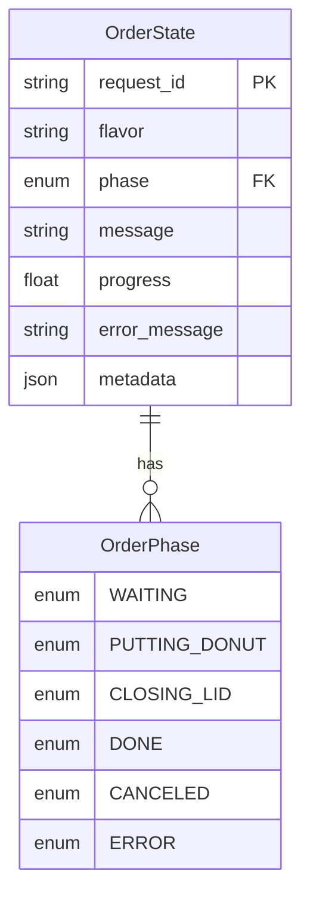

# GreatAkihabara Donuts - オーダーアプリ

React + TypeScriptで実装されたドーナツ注文アプリケーションです。

## アプリ構成

### システム構成図

```
┌─────────────────────────┐
│  フロントエンド          │
│  (React + TypeScript)   │
│  doughnuts_order_chatbot │
└──────────┬──────────────┘
           │ HTTP
           │
┌──────────▼──────────────┐
│   API Server            │
│   (FastAPI)             │
│   api.app:app           │
└──────────┬──────────────┘
           │ Unix Socket
           │
┌──────────▼──────────────┐
│  Robot Controller       │
│  (Worker Process)       │
│  robot_controller/worker│
└─────────────────────────┘
```

### ER図



## 起動方法

アプリケーションを起動するには、以下の3つのコンポーネントをそれぞれ起動する必要があります。

### 1. APIサーバーの起動

```bash
cd mission2/code/doughnuts_order_assistant
uv run uvicorn api.app:app --reload --host 0.0.0.0 --port 8000
```

APIサーバーは `http://0.0.0.0:8000` で起動します。

**注意**: APIサーバーは、so101が繋がっているPCで動かす必要があります。

### 2. ロボットコントローラー（Worker）の起動

```bash
cd mission2/code/doughnuts_order_assistant
uv run worker
```

Workerプロセスは、APIサーバーとUnix Socket経由で通信し、注文を処理します。

**注意**: ロボットコントローラーも、so101が繋がっているPCで動かす必要があります。

### 3. フロントエンドの起動

```bash
cd mission2/code/doughnuts_order_chatbot
npm run dev
```

フロントエンドは `http://localhost:3000` で起動します。

**注意**: フロントエンドは任意のPCで動かすことができます。

### API URLの設定について

フロントエンドのコードには、ngrokが発行したURLが直接埋め込まれています（`src/App.tsx`内）。

- ngrokのURLが変更された場合
- localhostを使用したい場合

上記の場合は、`src/App.tsx`内のAPIエンドポイントURLを修正する必要があります。

現在の設定箇所：
- `src/App.tsx` 68行目: 注文作成API (`/orders`)
- `src/App.tsx` 151行目: ステータス取得API (`/orders/{request_id}/status`)

## 機能

- チョコレートドーナッツとストロベリードーナッツの選択
- カート機能（数量の増減）
- 注文処理（ロード画面 → 完了画面）

## セットアップ

### 1. 依存関係のインストール

```bash
npm install
```

### 2. 開発サーバーの起動

```bash
npm run dev
```

ブラウザで `http://localhost:3000` が自動的に開きます。

### 3. ビルド

```bash
npm run build
```

## 使用方法

1. メニュー画面でドーナツを選択し、数量を調整します
2. フッターの「レジに進む」ボタンをクリックします
3. ロード画面で3秒間待機します（ロボットが詰め込んでいます）
4. 完了画面が表示されます

